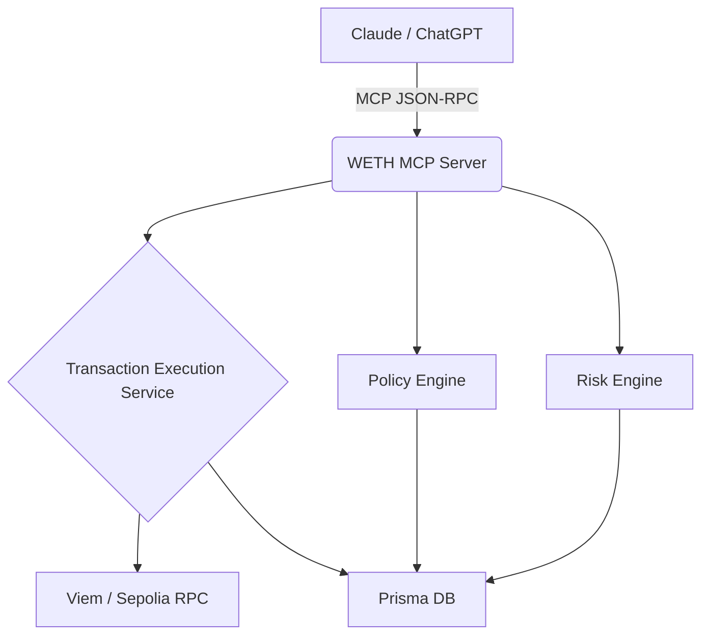

# Phase 2 Architecture

In Phase 2, the architecture evolves from a Read-Only execution layer into a Draft-Simulation-Analyze pipeline. 

**Layers Added:**
- Prisma `TransactionDraft`, `PolicyDecision`, `TransactionAudit` models.
- Fastify REST controllers.
- `PolicyEngine` and `RiskEngine` shared classes.
